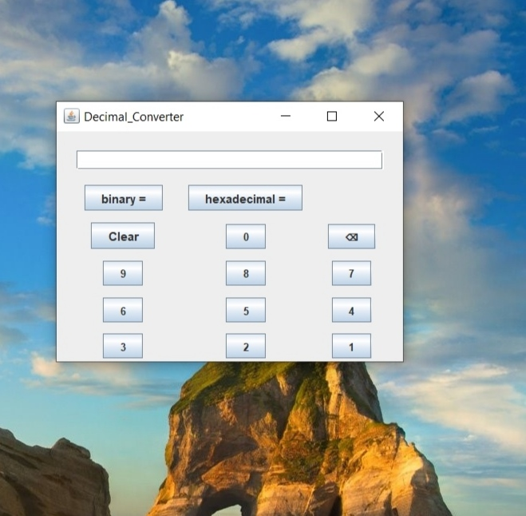
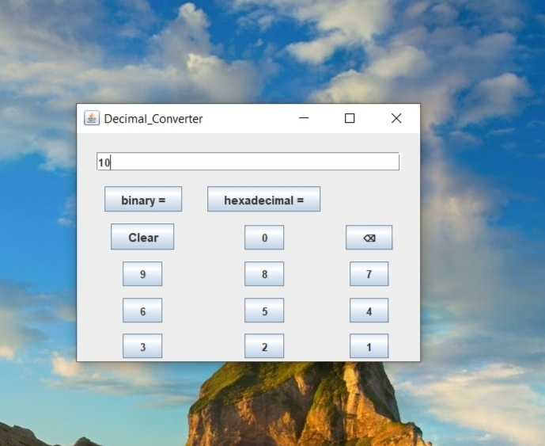
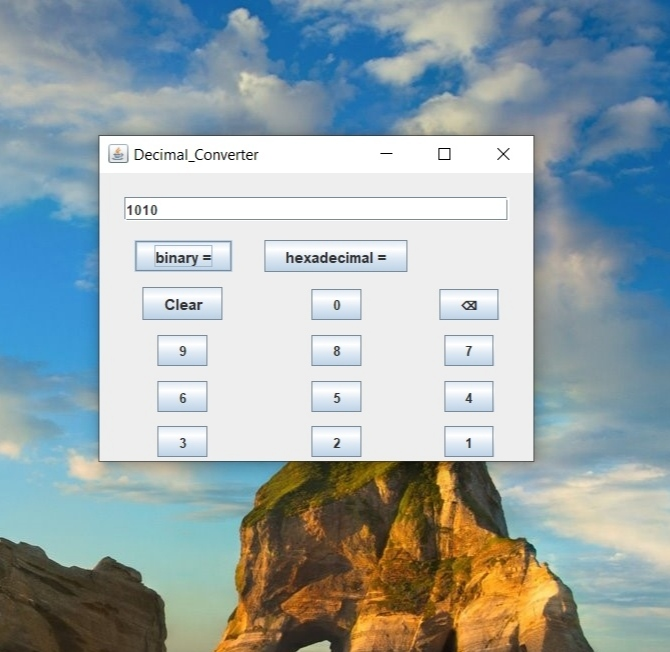
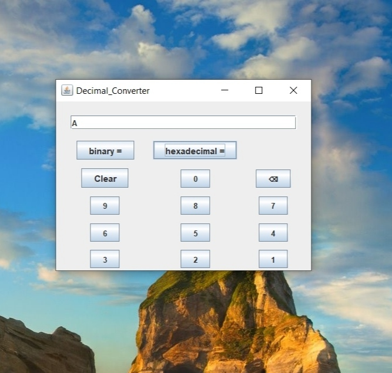

# Decimal to Binary/Hexadecimal Converter

## Getting Started

## Features
- It pops as a small box on a screen so other apps and sites can easily be used in computer using the converter at the same time
- It can give the binary of any number.
- It can give the hexadecimal of any number

## Contributers
Made my jyotirmay27 (https://github.com/jyotirmay27) 
contributors:
1) ujjwaltyagi888 (https://github.com/ujjwaltyagi888)
2) Parthtrap (https://github.com/Parthtrap)
3) abhinav2401 (https://github.com/abhinav2401)

## Screenshots

  
  

  

  

  
  

  

  
  

 
